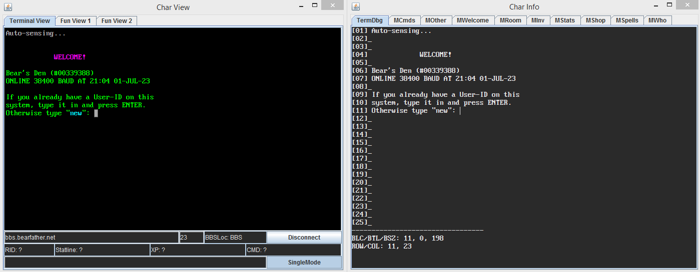
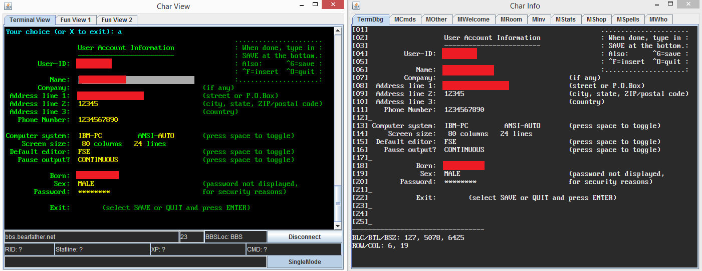
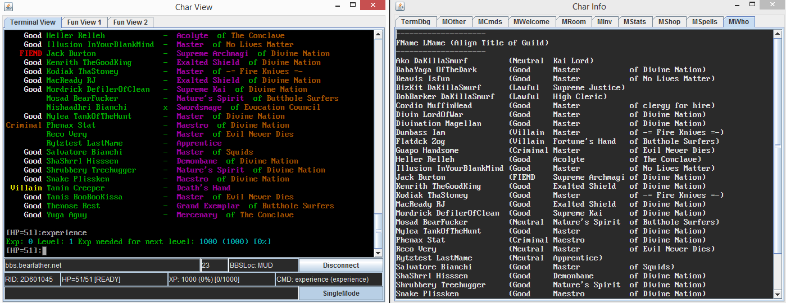

# OmegaMUD
Another attempt at a MegaMUD replacement in Java.

## Java Version Requirements
Tested with OpenJDK 1.6 (J6), 1.7 (J7), and 1.8 (J8).\
I assume equivalent Oracle Java versions will work.

## Apache Commons Net
Apache Commons Net telnet class files are built into the JAR during the build process.\
No external JARs are required.

## Environment Setup (Building/Running)
JAVA_HOME environment variable must be set to your Java location.\
The PATH environment variable on your system must have the Java bin path.

## Building
Run the batch (Win) or bash (Linux) script for the Java/Apache version you want to build for (see below).\
These scripts should be run from within the OmegaMUD dir:
```
_BUILD_J6.bat/sh
_BUILD_J7.bat/sh
_BUILD_J8.bat/sh
````
*Example: If you are building for Java 1.8, just run _BUILD_J8.bat (or .sh if on Linux)*

## Running
Command line run example for Java 1.6 version of OmegaMUD:
> java -jar OmegaMUD_J6.jar

*NOTE: the JAR filename will be different depending on which Java version it was built for.*

## What Works
* Telnet connectivity.
* Basic ANSI/terminal support (adding more CSI/commands as they are found).
* Debug frame with various tabs to show debug info.
* Toggle between single and multi-char input (send) type.
* Command throttling/queueing. Helpful for commands like search, pick, and bash.
* MegaMUD RoomID generation for backward MegaMUD support.
* Currently parsed MajorMUD data:
  * BBS Menu Detection
  * Editor Support + Prompt Detection
  * Statline
  * Rooms
  * Inventory
  * Stats
  * Exp
  * Shops
  * Spells
  * Who's Online
  * Basic Combat

## Tested Systems
WinXP, Win7, Win8, Win10\
Slackware Linux 15.0 x64\
Mac: Untested

## Screenshot: BBS Login


## Screenshot: BBS Main Menu


## Screenshot: BBS Account Edit


## Screenshot: MUD Edit Stats


## Screenshot: MUD Welcome


## Screenshot: MUD Command History


## Screenshot: MUD Show Stats


## Screenshot: MUD Room Items


## Screenshot: MUD Inventory


## Screenshot: MUD Shops


## Screenshot: MUD Spells


## Screenshot: MUD Who's Online


## Screenshot: MUD Combat

